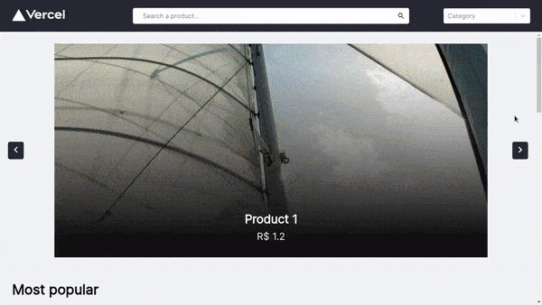

<div align="center">
    <br/>
    
    <br>
</div>

<br/>

# Catalogue it

<br/>

This is a product catalogue made in ReactJS and NextJs. This website contains all the main features of a product catalogue, and the admin page.

It is worth mentioning that, when cloning the repository, it is necessary to use the ```yarn``` command to load the modules and configure the application. After that, just run the ```yarn dev``` command to launch the software on localhost.

<br/>
